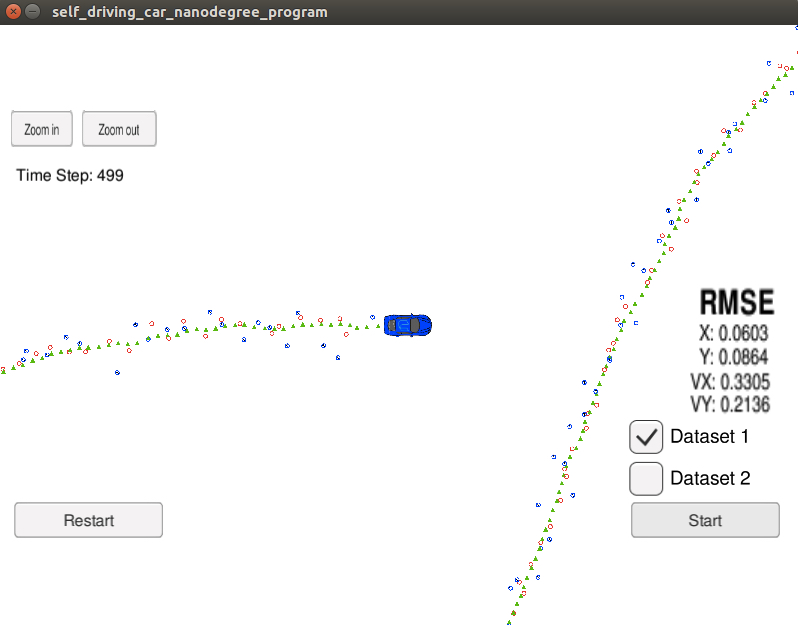
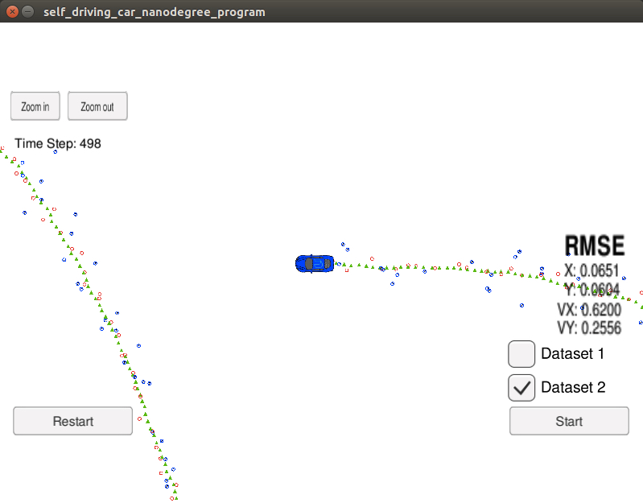

# Project Uscentend Kalman Filter
Udacity Self-Driving Car Nanodegree - Uscentend Kalman Filter Implementation

In this project utilize an Unscented Kalman Filter is implemented in C++ to estimate the state of a moving object of interest with noisy lidar and radar measurements. 

This project involves the Term 2 Simulator which can be downloaded [here](https://github.com/udacity/self-driving-car-sim/releases)

This repository includes two files that can be used to set up and intall [uWebSocketIO](https://github.com/uWebSockets/uWebSockets) for either Linux or Mac systems. For windows you can use either Docker, VMware, or even [Windows 10 Bash on Ubuntu](https://www.howtogeek.com/249966/how-to-install-and-use-the-linux-bash-shell-on-windows-10/) to install uWebSocketIO. Please see [this concept in the classroom](https://classroom.udacity.com/nanodegrees/nd013/parts/40f38239-66b6-46ec-ae68-03afd8a601c8/modules/0949fca6-b379-42af-a919-ee50aa304e6a/lessons/f758c44c-5e40-4e01-93b5-1a82aa4e044f/concepts/16cf4a78-4fc7-49e1-8621-3450ca938b77) for the required version and installation scripts.

Once the install for uWebSocketIO is complete, the main program can be built and ran by doing the following from the project top directory.

1. mkdir build
2. cd build
3. cmake ..
4. make
5. ./UnscentedKF

The CMakeLists.txt is also in the src folder for using in [Eclipse IDE](ide_profiles/Eclipse/README.md).

---

## Other Important Dependencies
* cmake >= 3.5
  * All OSes: [click here for installation instructions](https://cmake.org/install/)
* make >= 4.1 (Linux, Mac), 3.81 (Windows)
  * Linux: make is installed by default on most Linux distros
  * Mac: [install Xcode command line tools to get make](https://developer.apple.com/xcode/features/)
  * Windows: [Click here for installation instructions](http://gnuwin32.sourceforge.net/packages/make.htm)
* gcc/g++ >= 5.4
  * Linux: gcc / g++ is installed by default on most Linux distros
  * Mac: same deal as make - [install Xcode command line tools](https://developer.apple.com/xcode/features/)
  * Windows: recommend using [MinGW](http://www.mingw.org/)

## Generating Additional Data

If you'd like to generate your own radar and lidar data, see the
[utilities repo](https://github.com/udacity/CarND-Mercedes-SF-Utilities) for
Matlab scripts that can generate additional data.

## Project Instructions and Rubric

This information is only accessible by people who are already enrolled in Term 2
of CarND. If you are enrolled, see [the project page](https://classroom.udacity.com/nanodegrees/nd013/parts/40f38239-66b6-46ec-ae68-03afd8a601c8/modules/0949fca6-b379-42af-a919-ee50aa304e6a/lessons/c3eb3583-17b2-4d83-abf7-d852ae1b9fff/concepts/f437b8b0-f2d8-43b0-9662-72ac4e4029c1)
for instructions and the project rubric.

## Running the Filter

From the build directory, execute `./UnscentedKF`. The output should be:

```
Listening to port 4567
Connected!!!
```

The simulator provides two datasets. The differences between them are:

- The direction the car (the object) is moving.
- The order the first measurement is sent to the UKF. On dataset 1, the LIDAR measurement is sent first. On the dataset 2, the RADAR measurement is sent first.

Here is the simulator final state after running the UKF with dataset 1:



Here is the simulator final state after running the UKF with dataset 2:



# [Rubric](https://review.udacity.com/#!/rubrics/783/view) points

## Compiling

### Your code should compile.

The code compiles without errors.

## Accuracy

### For the new version of the project, there is now only one data set "obj_pose-laser-radar-synthetic-input.txt". px, py, vx, vy output coordinates must have an RMSE <= [.09, .10, .40, .30] when using the file: "obj_pose-laser-radar-synthetic-input.txt"

The UKF accuracy was:

- Dataset 1 : RMSE = [0.0603, 0.0865, 0.3305, 0.2136]
- Dataset 2 : RMSE = [0.0651, 0.0604, 0.6200, 0.2556]

## Following the Correct Algorithm

### Your Sensor Fusion algorithm follows the general processing flow as taught in the preceding lessons.

The UKF implementation could be found at [src/ukf.cpp](./src/ukf.cpp). On the [ProcessMeasurement](./src/ukf.cpp#L97) method, the [Prediction](./src/ukf.cpp#L151) is executed for the prediction step, and methods [UpdateRadar](./src/ukf.cpp#L177) and [UpdateLidar](./src/ukf.cpp#L183) are executed for the update step depending on the measurement type.

### Your Kalman Filter algorithm handles the first measurements appropriately.

The first measurement is handled at [ProcessMeasurement](src/ukf.cpp#L99) from line 99 to line 123.

### Your Kalman Filter algorithm first predicts then updates.

The prediction step is implemented at [Prediction](./src/ukf.cpp#L151) method from line 151 to line 163.

### Your Kalman Filter can handle radar and lidar measurements.

Different methods [UpdateRadar](./src/ukf.cpp#L177) and [UpdateLidar](./src/ukf.cpp#L183) are executed for the update step depending on the measurement type.

